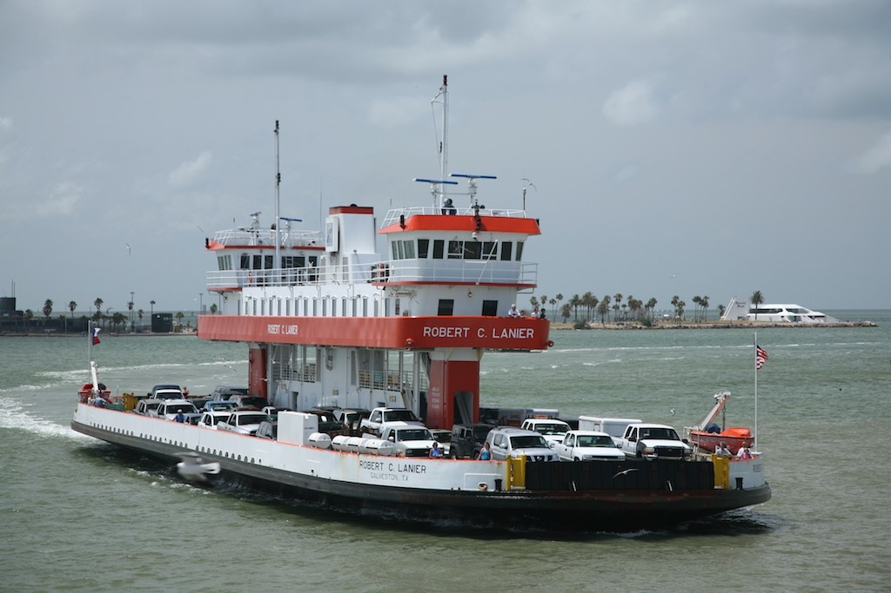

# Ferry Kata

## Instructions

Solve this Kata using TDD. Complete it in Javascript, Python, or Ruby. Once done in one Language in the allotted time try it out in another. Use flowcharts and diagrams to think through the required logic.

A ferry is a boat that carries people and things for a short distance between two places - typically between islands and over rivers.

[The Bolivar Gridge Ferry](https://en.wikipedia.org/wiki/Bolivar_Bridge)

## License

 codeX_ReleaseOneNarrativeWorkbook by <a xmlns:cc="http://creativecommons.org/ns#" href="project codeX" property="cc:attributionName" rel="cc:attributionURL">project codeX</a> is licensed under a <a rel="license" href="http://creativecommons.org/licenses/by-nc-nd/4.0/">Creative Commons Attribution-NonCommercial-NoDerivatives 4.0 International License</a>. Based on a work at <a xmlns:dct="http://purl.org/dc/terms/" href="http://projectcodex.co" rel="dct:source">http://projectcodex.co</a>.
